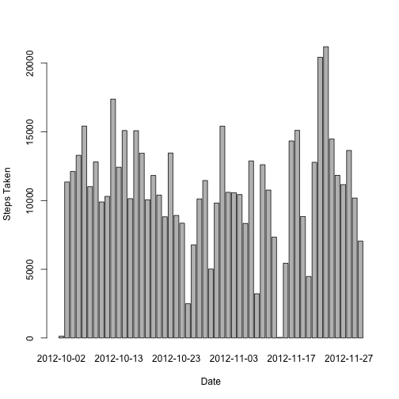
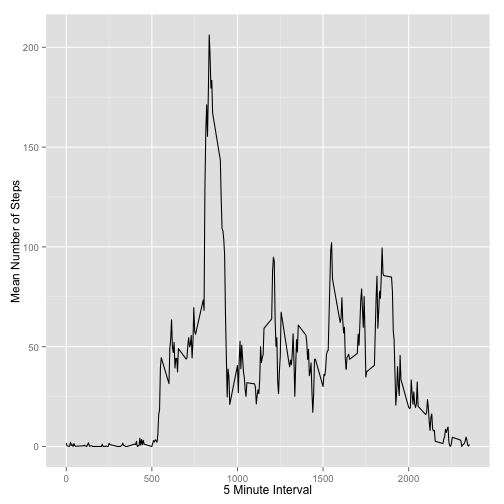
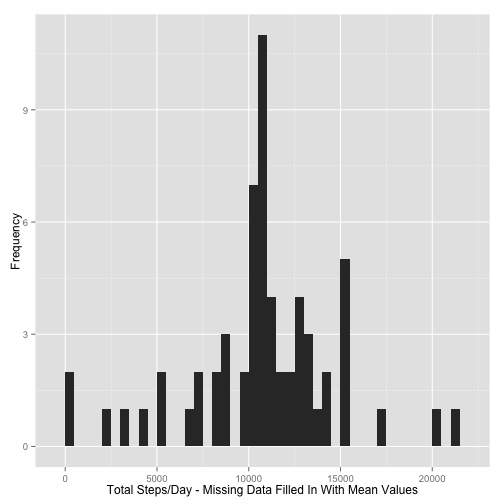
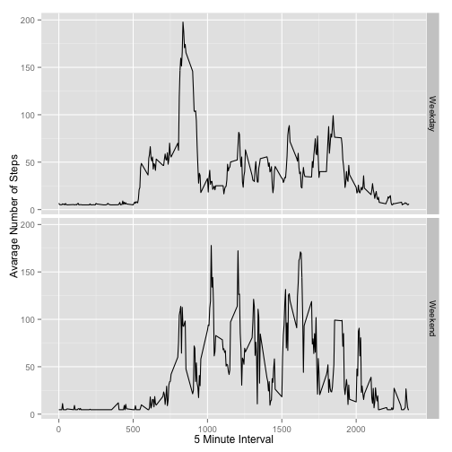

# *Reproducible Research Assessment 1**


```r
library(ggplot2)
library(scales)
library(Hmisc)
```

Loading and preprocessing the data

## 1. Load the data (i.e. read.csv())


```r
if(!file.exists('activity.csv')){
    unzip('activity.zip')
}

activity_data <- read.csv('activity.csv')
```
## 2. Process/transform the data (if necessary) into a format suitable for your analysis
What is mean total number of steps taken per day?

```r
steps_takenperday <- aggregate(steps ~ date, data = activity_data , FUN = sum)
```

## 1. Make a histogram of the total number of steps taken each day


```r
barplot(steps_takenperday$steps, names.arg = steps_takenperday$date, xlab = "Date", ylab = "Steps Taken")
```

 

## 2. Calculate and report the mean and median total number of steps taken per day


```r
steps_takenperday_Mean <- mean(steps_takenperday$steps)
steps_takenperday_Median <- median(steps_takenperday$steps)
steps_takenperday_Mean
```

```
## [1] 10766.19
```

```r
steps_takenperday_Median
```

```
## [1] 10765
```


## What is the average daily activity pattern?

```r
average_stepsperinterval <- aggregate(x=list(meanSteps=activity_data $steps), by=list(interval=activity_data$interval), FUN=mean, na.rm=TRUE)
```
## 1.  Make a time series plot (i.e. type = "l") of the 5-minute interval (x-axis) and the average number of steps taken, averaged across all days (y-axis)

```r
ggplot(data=average_stepsperinterval, aes(x=interval, y=meanSteps)) +
    geom_line() +
    xlab("5 Minute Interval") +
    ylab("Mean Number of Steps") 
```

 


## 2. Which 5-minute interval, on average across all the days in the dataset, contains the maximum number of steps?


```r
max_steps <- which.max(average_stepsperinterval$meanSteps)
timeofmaxsteps <- activity_data$interval[max_steps]
```
Most Steps Were At835

## Imputing missing values

1. Calculate and report the total number of missing values in the dataset

```r
numMissingValues <- length(which(is.na(activity_data$steps)))
```

The # of missing values is 2304
## 2. Devise a strategy for filling in all of the missing values in the dataset.

## 3. Create a new dataset that is equal to the original dataset but with the missing data filled in.

My method in this section, was to simply replace NA values with mean values of all non-NA values


```r
activityData_missingdatafilledin <- activity_data
activityData_missingdatafilledin$steps <- impute(activity_data$steps, fun=mean)
```
## 4. Make a histogram of the total number of steps taken each day


```r
stepsByDay_missingdatafilledin <- tapply(activityData_missingdatafilledin$steps, activityData_missingdatafilledin$date, sum)
qplot(stepsByDay_missingdatafilledin, xlab='Total Steps/Day - Missing Data Filled In With Mean Values', ylab='Frequency',binwidth=500)
```

 


## Calculate and report the mean and median total number of steps taken per day


```r
stepsByDayMean_missingdatafilledin <- mean(stepsByDay_missingdatafilledin)
stepsByDayMedian_missingdatafilledin <- median(stepsByDay_missingdatafilledin)
stepsByDayMean_missingdatafilledin
```

```
## [1] 10766.19
```

```r
stepsByDayMedian_missingdatafilledin
```

```
## [1] 10766.19
```

Mean  When Missing Data Filled In 1.0766189 &times; 10<sup>4</sup> 
Median When Missing Data Filled In 1.0766189 &times; 10<sup>4</sup>

## Are there differences in activity patterns between weekdays and weekends?

1. Create a new factor variable in the dataset with two levels – “weekday” and “weekend” indicating whether a given date is a weekday or weekend day.


```r
daytype <- function(date) {
    if (weekdays(as.Date(date)) %in%  "Saturday") {
        "Weekend"
    } 
  if (weekdays(as.Date(date)) %in%  "Sunday") {
        "Weekend"
    }
  else {
        "Weekday"
    }
}
activityData_missingdatafilledin$datefactortype <-as.factor(sapply(activityData_missingdatafilledin$date, daytype))
```
2. Make a panel plot containing a time series plot

```r
meanActivityData_missingdatafilledin <- aggregate(steps ~ interval + datefactortype, data=activityData_missingdatafilledin, mean)
ggplot(meanActivityData_missingdatafilledin, aes(interval, steps)) + 
    geom_line() + 
    facet_grid(datefactortype ~ .) +
    xlab("5 Minute Interval") + 
    ylab("Avarage Number of Steps")
```

 
